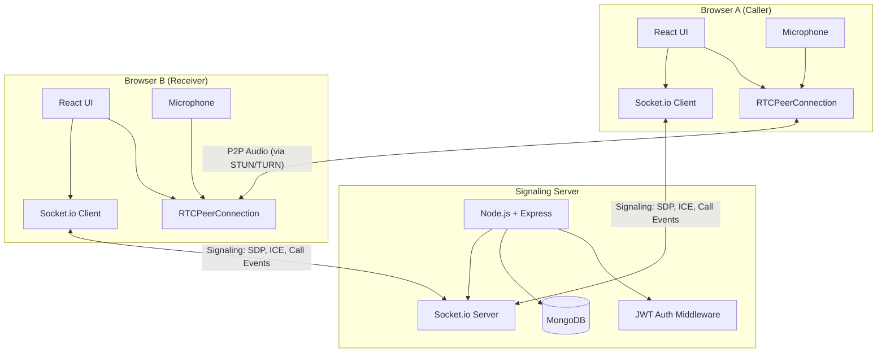

# Voice Calling System - Implementation Plan

A complete browser-based voice calling system for a CRM, enabling 1-to-1 voice calls between onboarded users using **WebRTC** for audio, **Socket.io** for signaling, **React** for the frontend, **Node.js/Express** for the backend, and **MongoDB** for persistence.

---

## 1. High-Level Architecture



**Key roles:**
- **Signaling Server** (Socket.io): Relays call events (offer, answer, ICE candidates) between peers. Does NOT carry audio.
- **WebRTC PeerConnection**: Establishes direct peer-to-peer audio between browsers.
- **STUN Server**: Helps clients discover their public IP (e.g., Google's free `stun:stun.l.google.com:19302`).
- **TURN Server**: Relays media when direct P2P fails (behind strict NATs/firewalls). Required for production.
- **SDP (Session Description Protocol)**: Describes media capabilities. Caller sends an **Offer**, receiver sends an **Answer**.
- **ICE Candidates**: Network path candidates discovered during connection setup, exchanged via signaling.

---

## 2. Call Flow (User A → User B)

| Step | Actor | Event / Action |
|------|-------|----------------|
| 1 | A | Clicks "Call" on User B → emits `call-user` via socket |
| 2 | Server | Validates both users, marks both `inCall`, forwards `incoming-call` to B |
| 3 | B | Sees incoming call modal → clicks Accept → emits `accept-call` |
| 4 | Server | Forwards `call-answered` to A |
| 5 | A | Creates `RTCPeerConnection`, gets mic stream, creates SDP Offer → emits `offer` |
| 6 | Server | Forwards `offer` to B |
| 7 | B | Creates `RTCPeerConnection`, gets mic stream, sets remote SDP, creates SDP Answer → emits `answer` |
| 8 | Server | Forwards `answer` to A |
| 9 | A & B | Exchange `ice-candidate` events through server |
| 10 | A & B | P2P audio connection established — voice call is live |
| 11 | Either | Clicks "End Call" → emits `end-call` → server cleans up state |

---

## 3. Project Structure

```
WebCalling/
├── backend/
│   ├── package.json
│   ├── server.js              # Express + Socket.io entry point
│   ├── config/
│   │   └── db.js              # MongoDB connection
│   ├── middleware/
│   │   └── auth.js            # JWT middleware
│   ├── models/
│   │   ├── User.js            # User schema
│   │   └── Call.js            # Call log schema
│   ├── routes/
│   │   └── auth.js            # Register & login routes
│   └── sockets/
│       └── callHandler.js     # All socket event handlers
│
├── frontend/
│   ├── package.json
│   ├── index.html
│   ├── vite.config.js
│   └── src/
│       ├── main.jsx
│       ├── App.jsx
│       ├── index.css           # Global dark theme styles
│       ├── context/
│       │   └── AuthContext.jsx # JWT auth state
│       ├── hooks/
│       │   ├── useSocket.js    # Socket.io connection
│       │   └── useWebRTC.js    # RTCPeerConnection logic
│       ├── pages/
│       │   ├── LoginPage.jsx
│       │   └── Dashboard.jsx
│       ├── components/
│       │   ├── UserList.jsx
│       │   ├── CallModal.jsx
│       │   └── ActiveCallPanel.jsx
│       └── services/
│           └── api.js          # Axios HTTP helpers
```

---

## 4. Database Design (MongoDB)

### User Schema
```js
{
  name:     String,       // required
  email:    String,       // required, unique
  password: String,       // hashed (bcrypt)
  online:   Boolean,      // default false
  socketId: String,       // current socket id
  inCall:   Boolean,      // default false
}
```

### Call Schema (call log)
```js
{
  caller:    ObjectId,    // ref User
  receiver:  ObjectId,    // ref User
  status:    String,      // enum: initiated, active, ended, rejected, missed
  startedAt: Date,
  endedAt:   Date,
}
```

---

## 5. Proposed Changes

### Backend

#### [NEW] [package.json](file:///c:/Users/Wsspl-dev14/OneDrive/Desktop/Go2Ismail/WebCalling/backend/package.json)
Dependencies: `express`, `socket.io`, `mongoose`, `jsonwebtoken`, `bcryptjs`, `cors`, `dotenv`

#### [NEW] [server.js](file:///c:/Users/Wsspl-dev14/OneDrive/Desktop/Go2Ismail/WebCalling/backend/server.js)
Express app + HTTP server + Socket.io initialization. Connects to MongoDB, applies CORS, mounts auth routes, initializes socket handler.

#### [NEW] [config/db.js](file:///c:/Users/Wsspl-dev14/OneDrive/Desktop/Go2Ismail/WebCalling/backend/config/db.js)
Mongoose connection helper using `MONGO_URI` from `.env`.

#### [NEW] [middleware/auth.js](file:///c:/Users/Wsspl-dev14/OneDrive/Desktop/Go2Ismail/WebCalling/backend/middleware/auth.js)
JWT verification middleware for HTTP routes. Also exports a socket auth middleware that verifies tokens on socket handshake.

#### [NEW] [models/User.js](file:///c:/Users/Wsspl-dev14/OneDrive/Desktop/Go2Ismail/WebCalling/backend/models/User.js)
Mongoose User model with fields: name, email, password, online, socketId, inCall.

#### [NEW] [models/Call.js](file:///c:/Users/Wsspl-dev14/OneDrive/Desktop/Go2Ismail/WebCalling/backend/models/Call.js)
Mongoose Call model for logging calls with caller, receiver, status, timestamps.

#### [NEW] [routes/auth.js](file:///c:/Users/Wsspl-dev14/OneDrive/Desktop/Go2Ismail/WebCalling/backend/routes/auth.js)
POST `/api/auth/register` — create user with hashed password, return JWT.  
POST `/api/auth/login` — validate credentials, return JWT.

#### [NEW] [sockets/callHandler.js](file:///c:/Users/Wsspl-dev14/OneDrive/Desktop/Go2Ismail/WebCalling/backend/sockets/callHandler.js)
All Socket.io event handlers:
- `register-user`: Mark user online, store socketId
- `disconnect`: Mark user offline, clean up active calls
- `call-user`: Validate target is online & not in call, emit `incoming-call`
- `accept-call`: Emit `call-answered` to caller
- `reject-call`: Emit `call-rejected` to caller, reset state
- `offer` / `answer`: Forward SDP between peers
- `ice-candidate`: Forward ICE candidates between peers
- `end-call`: Emit `call-ended` to peer, reset states, log call

#### [NEW] [.env](file:///c:/Users/Wsspl-dev14/OneDrive/Desktop/Go2Ismail/WebCalling/backend/.env)
Environment variables: `PORT`, `MONGO_URI`, `JWT_SECRET`.

---

### Frontend

#### [NEW] [package.json](file:///c:/Users/Wsspl-dev14/OneDone/Desktop/Go2Ismail/WebCalling/frontend/package.json)
Created via `npx create-vite`. Dependencies: `react`, `react-dom`, `socket.io-client`, `axios`, `react-router-dom`.

#### [NEW] [index.css](file:///c:/Users/Wsspl-dev14/OneDrive/Desktop/Go2Ismail/WebCalling/frontend/src/index.css)
Dark theme global styles. Discord/Slack-inspired color palette, Inter font, glassmorphism panels, pulse animations for ringing state.

#### [NEW] [context/AuthContext.jsx](file:///c:/Users/Wsspl-dev14/OneDrive/Desktop/Go2Ismail/WebCalling/frontend/src/context/AuthContext.jsx)
React context providing `user`, `token`, `login()`, `register()`, `logout()`. Persists token in localStorage.

#### [NEW] [hooks/useSocket.js](file:///c:/Users/Wsspl-dev14/OneDrive/Desktop/Go2Ismail/WebCalling/frontend/src/hooks/useSocket.js)
Custom hook: connects to Socket.io with JWT auth token, emits `register-user` on connect, returns socket instance.

#### [NEW] [hooks/useWebRTC.js](file:///c:/Users/Wsspl-dev14/OneDrive/Desktop/Go2Ismail/WebCalling/frontend/src/hooks/useWebRTC.js)
Custom hook encapsulating all WebRTC logic:
- `startCall(targetSocketId)`: get mic, create offer, send via socket
- `handleOffer(offer, callerSocketId)`: get mic, create answer
- `handleAnswer(answer)`: set remote description
- `addIceCandidate(candidate)`: add ICE candidate
- `endCall()`: close peer connection, stop media tracks
- `toggleMute()`: toggle mic track enabled
- Returns: `callStatus`, `isMuted`, `remoteAudioRef`

#### [NEW] [pages/LoginPage.jsx](file:///c:/Users/Wsspl-dev14/OneDrive/Desktop/Go2Ismail/WebCalling/frontend/src/pages/LoginPage.jsx)
Login / Register form with toggle. Calls AuthContext `login()` / `register()`.

#### [NEW] [pages/Dashboard.jsx](file:///c:/Users/Wsspl-dev14/OneDrive/Desktop/Go2Ismail/WebCalling/frontend/src/pages/Dashboard.jsx)
Main page after login. Contains `<UserList>`, `<CallModal>`, `<ActiveCallPanel>`. Listens to socket events and drives WebRTC hook.

#### [NEW] [components/UserList.jsx](file:///c:/Users/Wsspl-dev14/OneDrive/Desktop/Go2Ismail/WebCalling/frontend/src/components/UserList.jsx)
Displays online users with green dot indicators. "Call" button disabled if target is already in a call.

#### [NEW] [components/CallModal.jsx](file:///c:/Users/Wsspl-dev14/OneDrive/Desktop/Go2Ismail/WebCalling/frontend/src/components/CallModal.jsx)
Overlay modal for incoming calls with caller name, ringing animation, Accept/Reject buttons.

#### [NEW] [components/ActiveCallPanel.jsx](file:///c:/Users/Wsspl-dev14/OneDrive/Desktop/Go2Ismail/WebCalling/frontend/src/components/ActiveCallPanel.jsx)
Shown during active call. Displays call status (connecting → active), remote user name, call duration timer, Mute/Unmute button, End Call button, audio waveform visualization.

#### [NEW] [services/api.js](file:///c:/Users/Wsspl-dev14/OneDrive/Desktop/Go2Ismail/WebCalling/frontend/src/services/api.js)
Axios instance with base URL and auth interceptor.

#### [NEW] [App.jsx](file:///c:/Users/Wsspl-dev14/OneDrive/Desktop/Go2Ismail/WebCalling/frontend/src/App.jsx)
React Router setup with protected route to Dashboard.

---

## 6. Security

| Concern | Solution |
|---------|----------|
| API auth | JWT token required on all protected HTTP routes |
| Socket auth | Token sent in socket handshake `auth` option, verified in middleware |
| Call spoofing | Server validates caller identity from socket session, not from payload |
| Unauthorized calls | Server checks both users exist and are online before allowing call |
| Password storage | bcrypt hashing with salt rounds |

---

## 7. Scalability Notes

| Challenge | Solution |
|-----------|----------|
| Multiple server instances | Use `@socket.io/redis-adapter` to share socket state across processes |
| Load balancing | Nginx with sticky sessions (required for Socket.io polling fallback) |
| NAT traversal | Deploy a TURN server (coturn) for users behind strict firewalls |
| Call logging at scale | Index `Call` collection on `caller`, `receiver`, `startedAt` |
| Thousands of users | Namespace socket rooms, paginate user lists |

---

## 8. Deployment (Production)

| Component | Tool |
|-----------|------|
| Frontend | Build with `vite build`, serve via Nginx |
| Backend | Run with PM2 or Docker container |
| STUN/TURN | Self-hosted coturn or cloud provider (Twilio, Xirsys) |
| Reverse proxy | Nginx with SSL termination (Let's Encrypt) |
| Database | MongoDB Atlas or self-hosted with replica set |

---

## Verification Plan

### Manual Testing (2 browser tabs on localhost)

1. **Start backend**: `cd backend && npm run dev` (runs on port 5000)
2. **Start frontend**: `cd frontend && npm run dev` (runs on port 5173)
3. **Register 2 users**: Open two browser tabs, register "Alice" and "Bob"
4. **Verify presence**: Both should appear online in each other's UserList
5. **Initiate call**: Alice clicks "Call" on Bob → Bob sees incoming call modal
6. **Accept call**: Bob clicks Accept → both see ActiveCallPanel with "Connecting..." then "Active"
7. **Verify audio**: Speak into mic on one tab, hear on the other (requires two separate audio devices or headphones)
8. **Test mute**: Click mute → verify the other side hears silence
9. **End call**: Click "End Call" → both return to dashboard, call status reset
10. **Test reject**: Repeat call flow, Bob clicks "Reject" → Alice sees "Call Rejected"
11. **Test busy**: While Alice & Bob are in call, register "Charlie", verify Charlie sees them as "In Call" with disabled call buttons
12. **Test disconnect**: Close Bob's tab during a call → Alice should see call ended

> [!IMPORTANT]
> WebRTC audio requires either **HTTPS** or **localhost**. Testing on localhost works fine. For LAN/production testing, SSL is required.

> [!NOTE]  
> MongoDB must be running locally on `mongodb://localhost:27017` or provide a MongoDB Atlas URI in the `.env` file.
